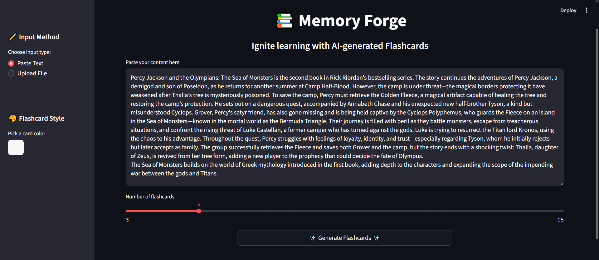
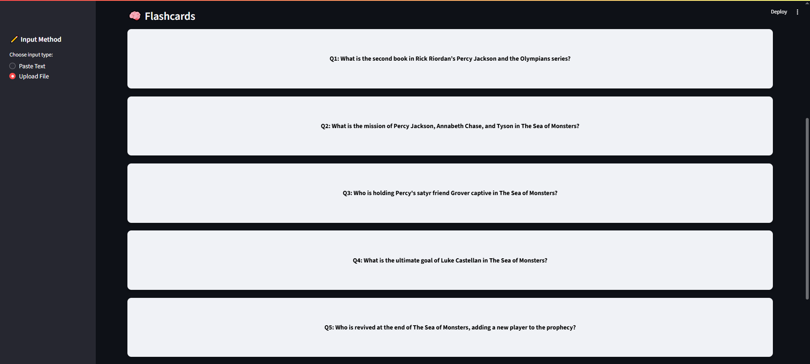

# Flashcard Generator App

An interactive and user-friendly flashcard generator built with **Streamlit**, powered by **LLMs** via Together AI. Upload a PDF or text file, and generate question-answer flashcards instantly. Fully editable interface with support for card management and export.

---

## Features

- **Upload Text or PDF**: Accepts `.txt` and `.pdf` files as input sources.
- **LLM-Powered Flashcard Generation**:
  - Uses Together AI's `mistralai/Mistral-7B-Instruct-v0.3` model.
  - Generates clean and relevant Q&A pairs from input content.
- **Edit Flashcards**: Inline editing of generated questions and answers.
- **Add New Cards**: Manually add custom flashcards.
- **Delete Flashcards**: Remove unwanted cards on the fly.
- **Interactive Flip Cards**:
  - Beautiful CSS-based flashcard animations.
  - Supports editing, deleting, and adding new cards.
- **Export Flashcards**:
  - **TXT**: Clean, readable format.
  - **CSV**: Suitable for spreadsheets.
  - **JSON**: Structured format for developers.

---

## GIF Demo


### Input Example


### Output Example


---

## Installation

```bash
git clone https://github.com/yashtijil/llm-flashcard-generator.git
cd llm-flashcard-generator
pip install -r requirements.txt
```

---

## Usage

To launch the app locally:

```bash
streamlit run app.py

```

Once running, the app will automatically open in your browser.

---

## Project Structure

```
flashcard-generator/
├── app.py                # Main streamlit app
├── flashcard_ui.py       # Contains CSS + card UI rendering logic
├── together_api.py       # Handles API calls to Together AI
├── .env                  # Stores your Together API key
├── requirements.txt
└── README.md
```

You must create a `.env` file in the root folder with the following format:

```
TOGETHER_API_KEY=your_together_api_key_here
```

---

## Tech Stack

- **Frontend**: [Streamlit](https://streamlit.io/)  (`app.py`)
- **Backend**: [Together AI](https://www.together.ai/) API (Mistral-7B-Instruct)  (`together_api.py`)
- **Styling**: Custom CSS-based flip cards (`flashcard_ui.py`)
- **LLM Prompting**: Clean and structured instruction prompt

---

## Future Enhancements (Planned)

- Save/load flashcard decks
- Tag-based search & filtering
- Flashcard quiz/revision mode
- Drag-and-drop card reordering
- User authentication and deck sharing